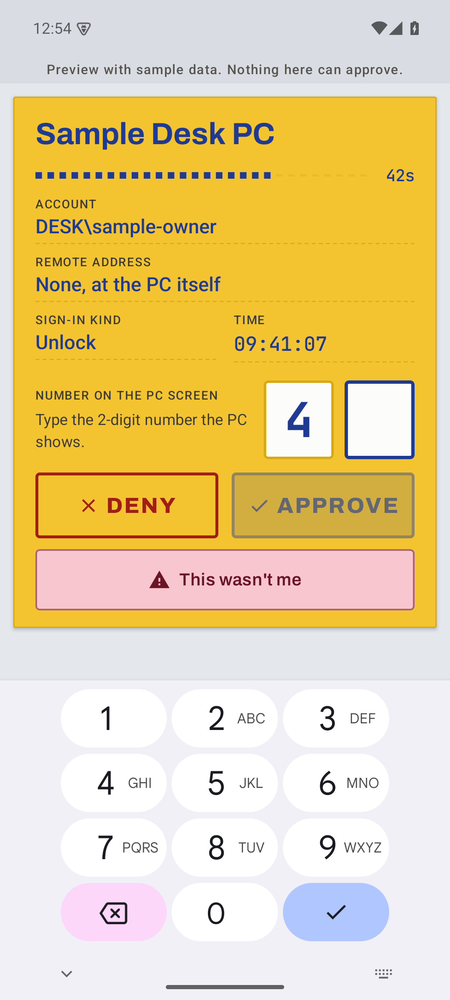
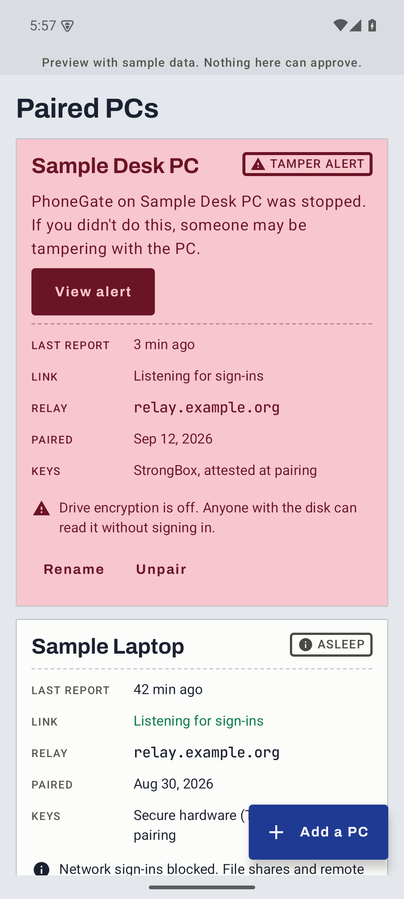
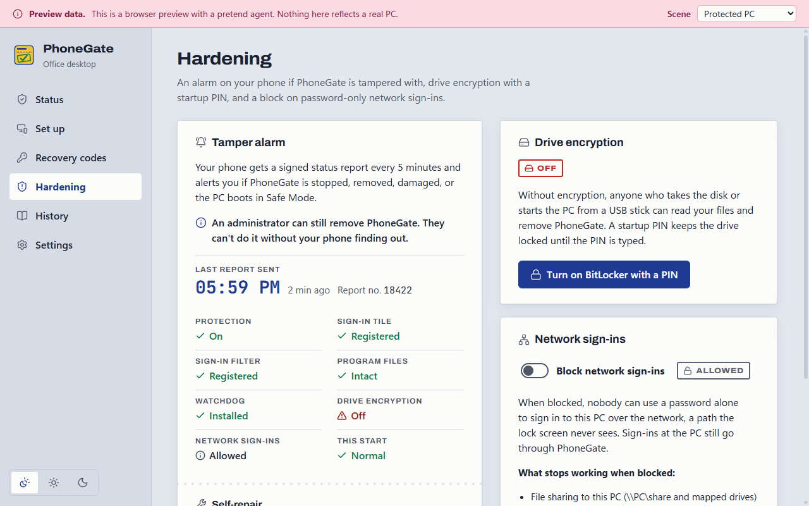
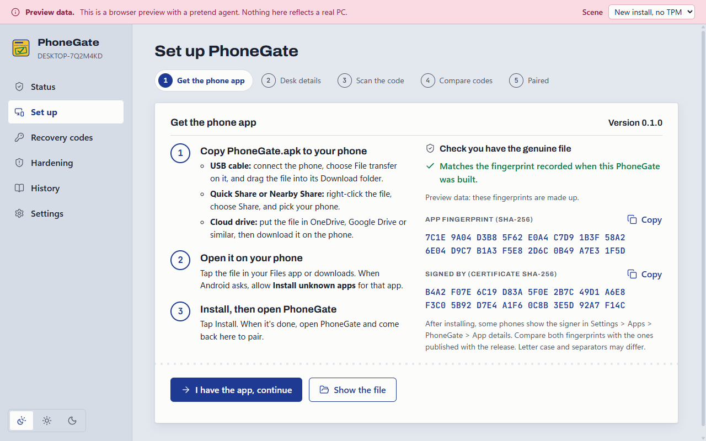

# PhoneGate

[](https://github.com/simplehima/phonegate/releases)
[](LICENSE)
[](#download)

**Your Windows PC stays locked until you approve the unlock on your Android phone.**

You type your password as usual. Then the PC shows a two-digit number. You type that number into
PhoneGate on your phone and touch the fingerprint sensor, and only then does the desktop open.
Anyone else, even someone who knows your password, gets a request on your phone that you can
deny or report with "This wasn't me".

PhoneGate is open source and self-hosted, and it is built to stay secure **when an attacker has
the complete source code, has reverse engineered every binary, and controls the server**:

- Every key is created on your own devices: a non-exportable key in the PC's TPM, and a
  biometric-bound key in the phone's secure hardware. Nothing secret exists in this repository or
  in any build.
- The relay server only forwards encrypted, signed messages. A hacked server can delay messages.
  It can never approve a sign-in, read a request, or replay an old approval.
- The gate runs inside the Windows sign-in screen (a Credential Provider in LogonUI) with other
  sign-in tiles hidden. It is not an app that can be closed.
- You are never locked out: offline approval by QR code, plus 10 single-use recovery codes.
- **Tampering can't happen silently.** Your phone receives a signed status report every 5
  minutes and alerts you if PhoneGate is stopped, removed or damaged, or if the PC boots into Safe
  Mode. A watchdog repairs PhoneGate and reports each repair. The companion can also turn on
  BitLocker with a startup PIN and block password-only network sign-ins.

Read **[docs/SECURITY.md](docs/SECURITY.md)** for the exact guarantees and the honest list of
what no software can protect against (for example, turn on BitLocker with a PIN).

## Screenshots

| Approving an unlock on the phone | Tamper alarm on the phone |
|---|---|
|  |  |

| PC app: hardening and tamper alarm | PC app: get the phone app |
|---|---|
|  |  |

Dark mode, large text and more: [docs/screenshots](docs/screenshots/). (Screens show preview
data, not a real PC.)

## Download

Get the latest release from **[Releases](https://github.com/simplehima/phonegate/releases)**:

| File | What it is |
|---|---|
| `PhoneGate-Setup-<version>.exe` | Windows setup wizard (64-bit Windows 10 22H2+ / 11). Includes the phone app. |
| `PhoneGate.apk` | The Android app (Android 11+), also inside the setup. |
| `phonegate-relay-linux-x86_64` | The relay server binary (used by the Dokploy deployment). |
| `SHA256SUMS.txt` | Checksums: verify before running anything. |

Step-by-step guides live in the **[wiki](https://github.com/simplehima/phonegate/wiki)** (the same pages are in [docs/wiki](docs/wiki/README.md)).

## Components

| | |
|---|---|
| `windows/` | The agent service (TPM keys, approvals), the credential provider DLL, and the companion app for pairing and settings. |
| `android/` | The approval app (Kotlin, Jetpack Compose). |
| `server/` + `deploy/` | The relay server and a one-command Docker + Caddy (automatic HTTPS) deployment. |
| `crates/pg-core` | The protocol, shared by every Rust component. See `docs/specs/001-phone-approved-unlock/contracts/protocol.md`. |

More detail is in [docs/ARCHITECTURE.md](docs/ARCHITECTURE.md). Specifications (spec, research,
plan, contracts) are in [docs/specs/](docs/specs/), and the engineering principles in
[docs/PRINCIPLES.md](docs/PRINCIPLES.md).

## Quick start

> ⚠️ **Try it in a virtual machine with a snapshot first.** PhoneGate changes how Windows signs
> you in. Keep your recovery codes somewhere safe.

1. **Relay** (on a VPS with a domain name). Pick one:
   - **Dokploy**: create an Application from this repository with Build Type *Dockerfile*,
     `deploy/dokploy/Dockerfile`, context `deploy/dokploy`, then add a domain on port 8080 with
     HTTPS. See [Hosting the relay](docs/wiki/Hosting-the-relay.md).
   - **Plain Docker + Caddy**:
     ```bash
     cd deploy && cp .env.example .env    # set PG_DOMAIN=relay.example.com
     docker compose up -d                 # Caddy fetches a TLS certificate automatically
     ```
2. **Windows**: run **`PhoneGate-Setup-<version>.exe`** and follow the wizard. Protection stays
   OFF after setup.
   - The setup isn't code-signed yet, so SmartScreen may warn ("More info" → "Run anyway").
     First check its SHA-256 against `SHA256SUMS.txt` from the release:
     `Get-FileHash .\PhoneGate-Setup-0.1.0.exe`
   - Uninstall from Settings → Apps. It refuses while protection is on.
3. **Phone**: the setup includes the Android app. Tick *Show the phone app* on the last page, or
   open PhoneGate → Set up → *Get the phone app*. Copy `PhoneGate.apk` to your phone (USB, Quick
   Share or your cloud drive), open it and install it. The PC app shows the APK's fingerprints so
   you can check it's genuine.
4. **Pair**: open PhoneGate on the PC, enter your relay address, and scan the QR code with the
   phone. Check that both screens show the same 6-digit code.
5. **Save your recovery codes**, type one back, then **turn protection on**.

One phone can protect several PCs: pair each one the same way.

### Building the setup yourself

```powershell
winget install JRSoftware.InnoSetup           # once
.	oolsndroid-release-key.ps1               # once: your own release key, kept OUTSIDE the repo
.\windows\installeruild-installer.ps1        # -> dist\installer\PhoneGate-Setup-<version>.exe + SHA256SUMS.txt
```

The build refuses to package a debug-signed APK. Back up `%USERPROFILE%\.phonegate-signing`:
Android only accepts updates signed with the same key. Without the setup, the scripts in
`windows/scripts/` (`build.ps1`, `install.ps1`, `uninstall.ps1`) still work.

## Development

```powershell
cargo test --workspace                        # protocol, relay, engine, E2E incl. hostile relay
cargo clippy --workspace --all-targets -- -D warnings
node tools/scan-secrets.mjs                   # no secrets in the tree
cd android; .\gradlew.bat testDebugUnitTest   # includes the shared protocol vectors
.\target\debug\phonegate-agent.exe --selftest-tpm   # checks this PC's TPM path
```

## License

Apache-2.0. See [LICENSE](LICENSE).
